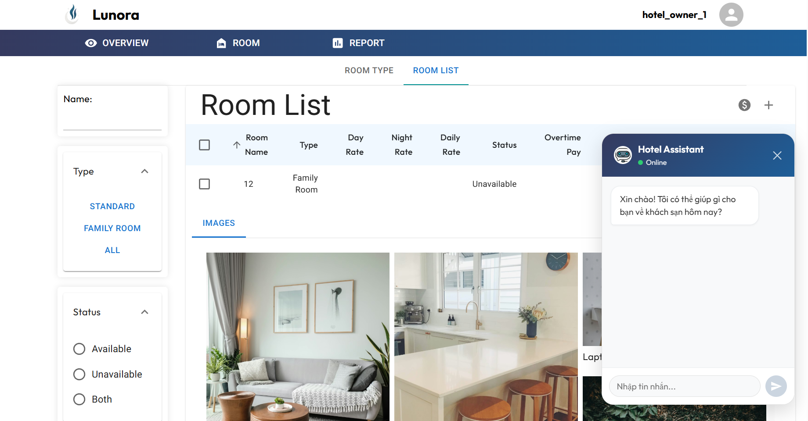

# Hotel Management System (HMS)

A web application for managing hotel operations, built with Spring Boot and React.


**Room List Interface integrated with Hotel Assistant**



## Technologies Used

- **Backend**: Spring Boot
- **Frontend**: React, Material-UI
- **Containerization**: Docker, Docker Compose
- **Database**: PostgreSQL

## Installation

To run the project, ensure you have Docker and Docker Compose installed. Then, follow these steps:

1. Clone the repository
2. cd Hotel-Management-System
3. Create a .env file in the root dictionary with the following variables:
   ```bash
   DB_USERNAME=your_database_username
   DB_PASSWORD=your_database_password
   EMAIL_USERNAME=your_email_username
   EMAIL_PASSWORD=your_email_password
   ```
5. Run the application:
   ```bash
   docker-compose up --build
   ```

## Features
- Room type management
- Booking management
- Booking list viewing
- Report generation
- Tracking revenue
- Payment
- Chatbot

## Google Cloud Deployment

This project can also be deployed as a cloud-native application on Google Cloud Platform.

### Cloud Architecture


### GCP Services

- **Firebase Hosting**: hosts the React frontend.
- **Cloud Run**: runs the Spring Boot backend container.
- **Cloud SQL for PostgreSQL**: stores hotel management relational data.
- **Firestore**: stores temporary registration codes and chatbot memory for scalable cloud state.
- **Secret Manager**: stores sensitive runtime configuration.
- **Artifact Registry**: stores backend Docker images.
- **Cloud Logging**: centralizes backend logs and request logs.
- **Terraform**: provisions GCP infrastructure under `infra/terraform`.
- **GitHub Actions**: builds and deploys backend/frontend on pushes to `main`.


## Project Structure
```text
Hotel-Management-System/
|-- backend/                  # Spring Boot backend
|-- frontend/                 # React frontend
|-- db/
|   `-- init/
|       `-- hms_db.sql        # PostgreSQL schema and seed data
|-- docs/
|   `-- cloud-native/         # Cloud-native migration notes
|-- infra/
|   `-- terraform/            # GCP infrastructure as code
|-- .github/
|   `-- workflows/            # GitHub Actions CI/CD workflows
|-- docker-compose.yml        # Local Docker Compose stack
|-- firebase.json             # Firebase Hosting configuration
|-- .firebaserc               # Firebase project mapping
`-- README.md
```
